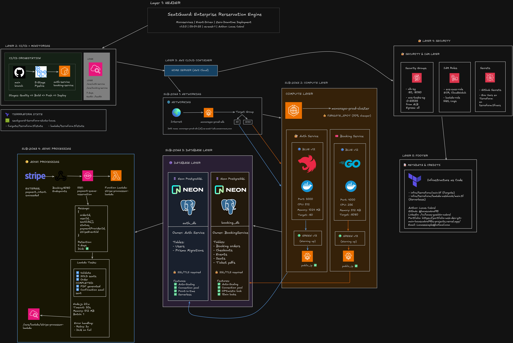

<p align="center">
	
</p>

# 🎟️ Booking Service — SeatGuard

Servicio de reservas de asientos para conciertos, parte del ecosistema SeatGuard. Gestiona inventario, bloqueo temporal de asientos, órdenes de compra, integración con Stripe y procesamiento asíncrono de pagos y notificaciones.

---

## Tabla de contenidos

- [Descripción general](#descripción-general)
- [Características principales](#características-principales)
- [Arquitectura y flujo de datos](#arquitectura-y-flujo-de-datos)
- [Estructura del proyecto](#estructura-del-proyecto)
- [API principal](#api-principal)
- [Configuración y ejecución local](#configuración-y-ejecución-local)
- [Variables de entorno](#variables-de-entorno)
- [Despliegue](#despliegue)
- [Contribuciones](#contribuciones)
- [Contacto](#contacto)

---

## Descripción general

**Booking Service** es el motor de reservas de SeatGuard, responsable de:

- Gestión de eventos, asientos y órdenes de compra.
- Bloqueo temporal de asientos (optimista, 15 minutos).
- Integración con Stripe para pagos.
- Procesamiento asíncrono de confirmaciones vía SQS y Lambda.
- Generación de tickets PDF y notificaciones por email.

Stack: Go (Golang), Gin, GORM, PostgreSQL, AWS SQS, Stripe, Docker.

---

## Características principales

- API RESTful para gestión de reservas y órdenes.
- Bloqueo de asientos en tiempo real para evitar sobreventa.
- Integración robusta con Stripe (checkout, webhooks).
- Procesamiento asíncrono de pagos y actualización de órdenes vía SQS y Lambda.
- Generación de tickets PDF y envío de emails de confirmación.
- Arquitectura desacoplada y escalable.

---

## Arquitectura y flujo de datos

<p align="center">
	
</p>

1. El usuario bloquea asientos vía API (`/api/v1/seats/lock/:id/uid/:uid`).
2. Se crea una orden de compra en estado `PENDING`.
3. Se inicia checkout con Stripe; el usuario paga.
4. Stripe notifica por webhook; el servicio encola mensaje en SQS.
5. Lambda consume el mensaje, marca asientos como `SOLD`, actualiza la orden a `COMPLETED`, genera ticket PDF y envía email.

---

## Estructura del proyecto

```
booking-service/
├── cmd/api/                # Entrypoint HTTP
├── internal/
│   ├── config/             # Configuración
│   ├── database/           # Conexión y migraciones
│   ├── handlers/           # HTTP handlers
│   ├── messaging/          # Cliente SQS
│   ├── middleware/         # Middlewares (auth, logging)
│   ├── models/             # Modelos de dominio
│   ├── repositories/       # Persistencia
│   ├── services/           # Lógica de negocio
├── pkg/                    # Utilidades y librerías
├── go.mod                  # Dependencias
├── Dockerfile              # Imagen de servicio
```

---

## API principal

Algunos endpoints clave:

- `POST /api/v1/seats/lock/:id/uid/:uid` — Bloquea asientos temporalmente.
- `POST /api/v1/stripe/create/checkout/session` — Inicia checkout Stripe.
- `POST /api/v1/orders` — Crea orden de compra.
- `GET /api/v1/orders/:id` — Consulta orden.
- `POST /api/v1/stripe/webhook` — Webhook de Stripe.
- `POST /api/v1/sqs/messaging` — Encola mensaje para procesamiento asíncrono.

Ver documentación OpenAPI/Swagger para detalles y ejemplos.

---

## Configuración y ejecución local

### Prerrequisitos

- Go 1.21+
- Docker y Docker Compose
- PostgreSQL

### Instalación y ejecución

```bash
# Instalar dependencias
go mod download

# Ejecutar migraciones y seed (opcional)
go run cmd/api/main.go -seed

# Ejecutar servicio
go run cmd/api/main.go

# O con Docker Compose (recomendado)
docker-compose up --build
```

El servicio estará disponible en `http://localhost:4000`.

---

## Variables de entorno

Configura un archivo `.env` basado en `.env.template`.

Variables principales:

| Variable              | Descripción                                 |
|-----------------------|---------------------------------------------|
| `PORT`                | Puerto de escucha (default: 4000)           |
| `DB_URL`              | URL de conexión a PostgreSQL                |
| `JWT_SECRET`          | Secreto para validar JWT                    |
| `STRIPE_SECRET_KEY`   | API key secreta de Stripe                   |
| `SQS_QUEUE_URL`       | URL de la cola SQS                          |
| `SMTP_HOST`           | Host SMTP para emails                       |
| `SMTP_USER`           | Usuario SMTP                                |
| `SMTP_PASS`           | Password SMTP                               |
| ...                   | ...ver `.env.template` para el resto        |

---

## Despliegue

Preparado para ECS/Fargate y Docker. Ver instrucciones en el README raíz del monorepo para despliegue con Terraform y scripts automatizados.

---

## Contribuciones

¡Las contribuciones son bienvenidas! Por favor, sigue las convenciones de commits y agrega pruebas para nueva lógica.

1. Haz fork del repo y crea una rama feature/fix.
2. Realiza tus cambios y tests.
3. Abre un Pull Request describiendo tu aporte.

---

## Contacto

- Autor: Lucas Cabral
- Email: lucassimple@hotmail.com
- LinkedIn: https://www.linkedin.com/in/lucas-gastón-cabral/
- Github: https://github.com/Lucascabral95

---

Desarrollado con ❤️ para SeatGuard.
